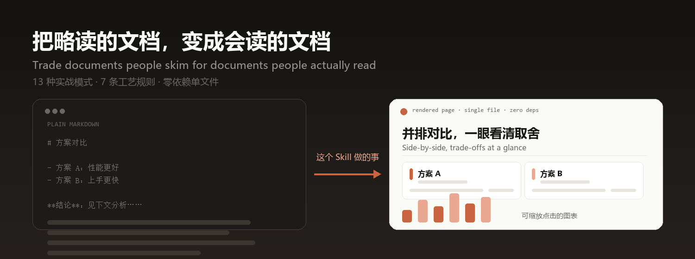
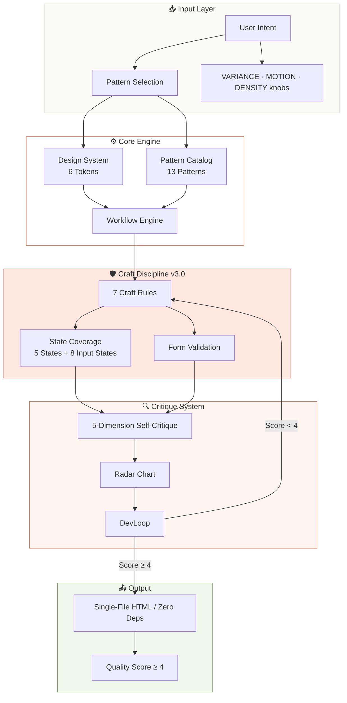
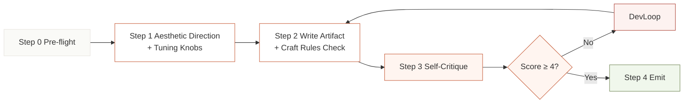
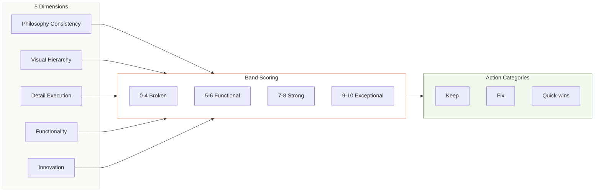
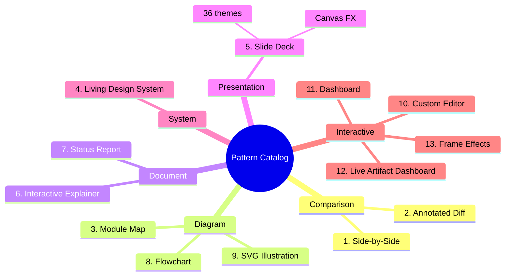

<div align="center">



**Trade documents people skim for documents people actually read**

[](LICENSE)
[](docs/RELEASE-v3.0.md)
[](https://github.com/YardonYan/html-skill-effectiveness)
[](#installation)
[](#pattern-catalog)
[](#design-system)

[中文](README.md) · **English**

</div>

---

> Trade documents people skim for documents people actually read.

AI is great at writing Markdown. But Markdown is linear and limited — tables and bold text only get you so far. This skill teaches AI to output **real HTML pages** instead: side-by-side comparisons that make trade-offs obvious, architecture diagrams you can zoom and click, slide decks with speaker notes, dashboards with live charts.

What makes this different from "just make me an HTML page"? Three things:

- **Craft Rules** — 7 hard rules that block AI slop before it reaches you (no purple gradients, no filler text, no invented numbers, real accessibility compliance)
- **Self-Critique** — the AI grades its own work on 5 dimensions and iterates until quality passes
- **Zero Dependencies** — every artifact is a single HTML file, everything inlined, opens in any browser with nothing to install

Compatible with any AI agent that supports skill files — Claude Code, OpenClaw, Cursor, Windsurf and more. 13 battle-tested patterns. Currently v3.0.

## Table of Contents

- [Architecture Overview](#architecture-overview)
- [Workflow Pipeline](#workflow-pipeline)
- [Critique System](#critique-system)
- [Pattern Catalog](#pattern-catalog)
- [What This Is](#what-this-is)
- [Installation](#installation)
- [Ways to use it](#ways-to-use-it)
- [Live Demos](#live-demos)
- [Design System](#design-system)
- [Workflow](#workflow)
- [Quality Standards](#quality-standards)
- [File Structure](#file-structure)
- [Example Prompts](#example-prompts)
- [Troubleshooting](#troubleshooting)
- [Changelog](#changelog)
- [Credits](#credits)
- [License](#license)

---

<a id="architecture-overview"></a>

## Architecture Overview



<a id="workflow-pipeline"></a>

## Workflow Pipeline



<a id="critique-system"></a>

## Critique System



<a id="pattern-catalog"></a>

## Pattern Catalog



> **Craft Rules apply to ALL patterns.** Before emitting any pattern, run through the Craft Rules checklist. No pattern is exempt from P0 rules.

| # | Pattern | Use For |
|---|---------|---------|
| 1 | **Side-by-Side Comparison** | Tech choices, design options, trade-offs |
| 2 | **Annotated Diff** | PR reviews, code changes, before/after |
| 3 | **Module Map** | Architecture diagrams, data flow |
| 4 | **Living Design System** | Colour palettes, typography, component catalogs |
| 5 | **Slide Deck** | Presentations, walkthroughs, demos |
| 6 | **Interactive Explainer** | Teaching concepts, documentation |
| 7 | **Status Report** | Weekly updates, incident reports |
| 8 | **Flowchart** | Pipelines, decision trees, workflows |
| 9 | **SVG Illustration** | Blog diagrams, figures, icons |
| 10 | **Custom Editor** | Triage boards, prompt tuning, configuration |
| 11 | **Dashboard** | Metrics, KPIs, monitoring views |
| 12 | **Live Artifact Dashboard** | Refreshable dashboards with a template + data architecture |
| 13 | **Frame Effects** | Cinematic visual moments |

---

<a id="what-this-is"></a>

## What This Is

AI defaults to Markdown. Markdown is linear text — great for reading sequentially, terrible for:

- Side-by-side comparisons
- Architecture diagrams
- Interactive explainers
- Data dashboards
- Slide decks
- Code diffs with annotations

**HTML can do all of these.** This skill teaches AI how to generate them well.

Every artifact is:

- **Single file** — inline CSS and JavaScript, zero external dependencies
- **Self-contained** — open in any browser, no server needed
- **Visually polished** — design system, typography, spacing, colour tokens
- **Pattern-based** — 13 proven patterns for common AI output scenarios

<a id="installation"></a>

## Installation

### Using the installer (recommended)

The repo ships a zero-dependency installer that copies the skill into the skills directory of each AI app on your machine:

```bash
node tools/install.mjs --list                 # list available targets
node tools/install.mjs --ai workbuddy         # install into WorkBuddy
node tools/install.mjs --ai all               # every target
node tools/install.mjs --ai all --dry-run     # preview only, writes nothing
node tools/install.mjs --ai workbuddy --uninstall   # remove
```

Targets verified to exist on a real machine: WorkBuddy, TRAE China edition, CodeBuddy, Claude Code, Codex CLI, OpenClaw, Qwen Code, cc-switch. `cursor` and the generic `.agents` target use the conventional path and have not been verified.

### Installing as a plugin (WorkBuddy / CodeBuddy / Claude Code)

The repository root carries `.codebuddy-plugin/` and `.claude-plugin/` manifests, so it can be registered directly as a single-plugin marketplace and installed as a plugin rather than by copying directories.

The field names and values follow the manifests shipped inside the apps themselves — this is not a format of my own invention. **The file format was checked field by field against the apps' own bundled marketplaces; the end-to-end register-and-load flow has not been verified.** Where you register it depends on the version you have.

Regenerate the manifests after changing the `name` or version in `SKILL.md`:

```bash
node tools/build_plugins.mjs .
```

### Manual installation

```bash
git clone https://github.com/YardonYan/html-skill-effectiveness.git
```

Or download the latest ZIP from [Releases](https://github.com/YardonYan/html-skill-effectiveness/releases).

**OpenClaw**

```bash
cp -r html-skill-effectiveness ~/.qclaw/skills/
```

Or use SkillHub:

```bash
openclaw skill install html-effectiveness
```

**Claude Code**

```bash
cp -r html-skill-effectiveness ~/.claude/skills/
```

**Cursor / other AI tools**

The core is a single `SKILL.md` — copy or symlink it wherever your tool loads rules from:

```bash
# Cursor: copy into .cursorrules or your Rules directory
cp SKILL.md ~/.cursorrules/html-effectiveness.md
```

Any AI coding assistant that reads markdown instruction files can use this skill — just point it at `SKILL.md`.

<a id="live-demos"></a>

## Ways to use it

How you install this depends on which AI assistant you use. Installing into several on the same machine is fine — they do not conflict.

### One command, any assistant

The repo ships a zero-dependency installer, so there is no manual directory copying:

```bash
git clone https://github.com/YardonYan/html-skill-effectiveness.git
cd html-skill-effectiveness
node tools/install.mjs --list          # list the targets available on this machine
node tools/install.mjs --ai workbuddy  # install into one
node tools/install.mjs --ai all        # install into all of them
```

### Mainland China tools

| Target id | Assistant | Global directory | Per-project directory |
| --- | --- | --- | --- |
| `workbuddy` | WorkBuddy | `~/.workbuddy/skills` | `.workbuddy/skills` |
| `codebuddy` | CodeBuddy | `~/.codebuddy/skills` | `.codebuddy/skills` |
| `trae-cn` | TRAE China edition | `~/.trae-cn/skills` | `.trae-cn/skills` |
| `qoder` | Qoder | `~/.qoder-cn/skills` | `.qoder/skills` |
| `qwen` | Qwen Code | `~/.qwen/skills` | `.qwen/skills` |
| `openclaw` | OpenClaw | `~/.openclaw/workspace/skills` | `.openclaw/skills` |
| `cc-switch` | cc-switch | `~/.cc-switch/skills` | `.cc-switch/skills` |

Qoder needs `/skills reload` or a session restart before it picks the skill up. OpenClaw additionally has a skill marketplace, SkillHub (Tencent Cloud hosted, `openclaw skill install <slug>`), reachable directly from mainland China.

### Elsewhere

| Target id | Assistant | Global directory | Per-project directory |
| --- | --- | --- | --- |
| `claude` | Claude Code | `~/.claude/skills` | `.claude/skills` |
| `codex` | Codex CLI | `~/.codex/skills` | `.codex/skills` |
| `cursor` | Cursor | `~/.cursor/skills` | `.cursor/skills` |
| `agents` | Generic agent standard | `~/.agents/skills` | `.agents/skills` |

These normally require access to international networks when used from mainland China.

Without a flag it installs globally (available to every project); add `--project` to install into relative directories inside the current project, which suits committing it alongside the code.

### Network notes for mainland China

The installer only reads and writes local files — it makes no network calls. What network conditions actually affect is the demo pages and external assets:

| Item | Situation |
| --- | --- |
| 演示页 | `docs/` the four demo pages have zero external dependencies and open directly |
| 生成的工件 | the P0 rules forbid external CSS/JS and CDNs, so generated HTML opens fine |

### Installing as a plugin

The repository root carries four sets of plugin manifests, so a supporting assistant can install it directly instead of copying directories:

| Assistant | Manifest | How |
| --- | --- | --- |
| WorkBuddy / CodeBuddy | `.codebuddy-plugin/` | Add this repository path or URL under marketplace settings |
| Claude Code | `.claude-plugin/` | `/plugin marketplace add YardonYan/html-skill-effectiveness` then `/plugin install html-skill-effectiveness@YardonYan-html-skill-effectiveness` |
| Codex | `.codex-plugin/` | Follow Codex's plugin install flow, pointing at this repository |
| Cursor | `.cursor-plugin/` | `/add-plugin`, or search the plugin marketplace |

The field names and values follow the manifests shipped inside each assistant — this is not a format of my own invention. **The manifest files were checked field by field; the register-and-load flow has not been verified end to end.** Where you register it depends on the version you have.

### Where it does not apply

A few environments get asked about but have no mechanism for this. Listed here so nobody wastes time:

| Environment | Situation |
| --- | --- |
| Browser IDEs (CodeSandbox, StackBlitz, Replit) | A skill is an instruction file for an AI assistant, not a runnable app — these environments have no entry point for loading one |
| Cloud shells (Google Cloud Shell, AWS CloudShell) | Same as above. If you only want to run the repo's scripts, `git clone` and run the documented commands; that is unrelated to skill loading |
| Uploading the repository ZIP to an assistant's skill upload dialog | The repo includes references and scripts, which may exceed file-count limits; the installer or a plugin marketplace is more reliable |
| Mobile | The assistants above have no meaningful mobile client |

---

## Live Demos

| Demo | Description |
|------|-------------|
| [Full Pattern Showcase](https://raw.githack.com/YardonYan/html-skill-effectiveness/main/docs/demo.html) | 13 patterns + v3.0 State Coverage, Form Validation and Tuning Knobs |
| [Pattern Showcase (EN)](https://raw.githack.com/YardonYan/html-skill-effectiveness/main/docs/demo_en.html) | English pattern showcase with v3.0 features |
| [Pattern Showcase (ZH)](https://raw.githack.com/YardonYan/html-skill-effectiveness/main/docs/demo_zh.html) | Chinese pattern showcase with v3.0 features |
| [v2.1 Demo (Archived)](https://raw.githack.com/YardonYan/html-skill-effectiveness/main/docs/test-v21-demo.html) | v2.1 Frame Effects + Live Dashboard archive |

> Links use raw.githack.com to render HTML directly. May take a few seconds on first load.

<a id="design-system"></a>

## Design System

### Core Tokens (6 variables)

```css
:root {
  --bg:      #fafaf7;   /* page background */
  --surface: #ffffff;   /* cards, panels */
  --fg:      #1a1916;   /* primary text */
  --muted:   #6b6964;   /* secondary text */
  --border:  #e8e5df;   /* dividers */
  --accent:  #c96442;   /* one accent, max 2× per visual region */
}
```

Everything else derives from these six tokens via `color-mix()`. No raw hex outside `:root`.

### Typography

| Element | Font | Size |
|---------|------|------|
| H1 | Display serif | clamp(44px, 6vw, 76px) |
| H2 | Display serif | clamp(32px, 4vw, 48px) |
| Body | System sans | 16px |
| Code | Mono | 13px |
| Eyebrow | Mono | 11px, uppercase |

Use system font fallback chains. Prioritise built-in system fonts over external Google Fonts.

---

<a id="workflow"></a>

## Workflow

### Step 0 — Pre-flight

Read `SKILL.md` end-to-end, understand the user's intent, map it to the Pattern Catalog, and plan the section list.

### Step 1 — Choose an Aesthetic Direction

Establish purpose, tone, constraints and differentiation. Fine-tune the output through the **Tuning Knobs**: VARIANCE, MOTION and DENSITY, each 1–10, default 5. Every aesthetic direction ships with 1–2 real brand references.

### Step 2 — Write the Artifact

Copy the HTML structure template, define the 6 tokens in `:root`, build sections from the Pattern Catalog, and run the Craft Rules check.

### Step 3 — Critique

Run the 5-dimension self-critique, band-score each dimension from 0 to 10, and produce a Keep / Fix / Quick-wins report.

### Step 4 — DevLoop

Apply the Keep items, address the Fix items, re-score. Maximum of 3 iterations.

### Step 5 — Emit

```
<artifact identifier="slug" type="text/html" title="Title">
<!doctype html>
<html>...</html>
</artifact>
```

<a id="quality-standards"></a>

## Quality Standards

### P0 — Must Never Happen (15 items)

1. No external CSS/JS files
2. No CDN libraries
3. No raw hex outside `:root`
4. No purple, violet or indigo gradient backgrounds
5. No default Tailwind indigo (`#6366f1`, `#8b5cf6`) as an accent
6. No emoji as feature icons
7. No invented metrics
8. No filler copy
9. `data-od-id` on every `<section>`
10. Mobile reflow must work (≤920px)
11. ALL CAPS must carry `letter-spacing` ≥ `0.06em`
12. Display text (≥32px) must use negative tracking
13. Display text must use `var(--font-display)`, not system-sans
14. No rounded card + coloured left-border accent
15. Style off `:user-invalid`, not `:invalid`

### P1 — Should Avoid (10 items)

- Walls of text
- Pure black or pure white
- Over-animation (max 500ms for non-cross-screen motion)
- Generic AI aesthetics
- Inter / Roboto as display fonts
- A standard Hero → Features → Pricing → FAQ → CTA template without variation
- External placeholder image CDNs
- `var(--accent)` used 6 or more times (cap: 2 per visual region)
- `outline: none` without a replacement focus style
- Validating on the first keystroke

### Scoring Discipline

- **No averaging** — each dimension is scored independently
- **No inflation** — 7+ requires exceptional evidence
- **Evidence-cited** — every score must cite specific observations

---

<a id="file-structure"></a>

## File Structure

```
html-skill-effectiveness/
├── SKILL.md                     # Core skill definition (v3.0)
├── .codebuddy-plugin/              Plugin manifests (WorkBuddy / CodeBuddy)
├── .codex-plugin/                  Plugin manifest (Codex)
├── .cursor-plugin/                 Plugin manifest (Cursor)
├── .claude-plugin/                 Plugin manifests (Claude Code)
├── README.md                    # Chinese README
├── README.en.md                 # English README (this file)
├── LICENSE                      # Apache-2.0 licence
├── assets/
│   └── hero.png                 # README hero image
├── tools/
│   ├── gen_readme_images.py     # Generates README images (Pillow)
│   └── build_plugins.mjs        # Generates plugin manifests
├── references/                  # Reference library
│   ├── pattern-examples.md      # Code snippets by pattern
│   ├── complete-examples.md     # Full HTML examples
│   ├── craft-rules-reference.md # Craft rules quick reference
│   ├── palette-examples.md      # 16-colour palette + 4 alternatives
│   ├── style-recipes.md         # Aesthetic direction × brand reference map
│   ├── presenter-mode.md        # BroadcastChannel dual-window presenter mode
│   ├── ux-laws-reference.md     # Complete 26 UX laws
│   ├── accessibility-detail.md  # WCAG compliance details
│   └── device-frames.md         # CSS device frame code
└── docs/                        # Process docs and demos
    ├── demo.html                # Full pattern showcase
    ├── demo_en.html             # English showcase
    ├── demo_zh.html             # Chinese showcase
    ├── test-v21-demo.html       # v2.1 demo archive
    ├── BLOG.md                  # Detailed blog post
    ├── INTEGRATION_SUMMARY.md   # Version integration history
    ├── RELEASE-v2.1.md          # v2.1 release notes
    └── RELEASE-v3.0.md          # v3.0 release notes
```

---

<a id="example-prompts"></a>

## Example Prompts

- "Generate a status report as HTML"
- "Make this comparison visual with HTML"
- "Create an interactive explainer for [concept]"
- "Build a slide deck about [topic]"
- "Design a triage board for these tickets"
- "Draw a flowchart of this process"
- "Show me component variants in HTML"
- "Make this HTML prettier / more professional"
- "Create a dashboard for [metrics] --variance=7 --motion=4 --density=5"
- "Make a presentation with speaker notes"
- "Critique this HTML output and suggest improvements"
- "Add a live artifact dashboard with refreshable data"
- "Apply frame effects to make this page cinematic"

---

<a id="troubleshooting"></a>

## Troubleshooting

### Installed, but the skill never fires

Check three things, in order:

1. **Is `SKILL.md` at the top level of the skill directory?** The correct shape is `<app-skills-dir>/html-skill-effectiveness/SKILL.md`. An extra directory layer hides it from the app.
2. **Restart the app.** Most apps scan the skills directory only at startup.
3. **Is that the directory the app actually scans?** Run `node tools/install.mjs --list`.

### The chat prints a literal `<artifact ...>` tag

The skill wraps its output in `<artifact identifier="slug" type="text/html" title="...">`, which is a convention some AI apps understand. Where the app does not, the tag shows up as plain text.

Ask for a file instead:

```
Don't wrap it in an artifact — write an index.html file to the current directory
```

### The output still looks like generic AI slop

Purple gradients, emoji as icons, rounded cards with coloured left borders — all explicitly banned by the P0 rules. When they still appear, the skill has not actually taken over and the model is writing from habit.

Be explicit:

```
Follow the html-skill-effectiveness craft rules. Show me the P0 checklist results line by line before writing any code.
```

The skill runs a 5-dimension self-critique after writing; ask for those results and you can tell whether the rules took effect.

### I want a different visual style

Use the tuning knobs rather than rewriting the prompt:

| Knob | Low (1–3) | High (8–10) |
|------|-----------|-------------|
| `--variance` | Centred, minimal | Bold, asymmetric |
| `--motion` | Subtle micro-interactions | Complex choreography |
| `--density` | Spacious (24–96px spacing) | Dense (8–32px, suits dashboards) |

```
Build a data dashboard, --variance=7 --motion=3 --density=8
```

### Charts in the page do not render

The skill enforces zero dependencies: no external CSS/JS files and no CDN libraries. Charts must therefore be inline SVG or pure CSS — ECharts, Chart.js and friends are not allowed. If the generated output pulls in an external chart library, it has violated its own P0 rule; say so and ask for a fix:

```
This page loads an external chart library, which breaks the zero-dependency rule. Rewrite it as inline SVG.
```

### When not to use this skill

Scenarios needing authentication, payments or backend logic are out of scope — the skill produces static single-file HTML with no server side. It cannot do those, and should not pretend to.

---

<a id="changelog"></a>

## Changelog

### v3.0 (2026-06-29) — Craft Discipline Revolution

**Added:**

- 7 checkable Craft Rules (Anti-AI-Slop, Color, Typography, Typography Hierarchy, Animation, Accessibility, UX Laws), all grounded in primary research with cited sources
- State Coverage contract (5 mandatory UI states: Loading / Empty / Error / Populated / Edge)
- Form Validation state machine (8 input states + 4 validation-timing rules)
- Tuning Knobs interface (VARIANCE / MOTION / DENSITY) so users can nudge the output style via parameters
- Brand-reference anchoring for every aesthetic direction, each with 1–2 real brand examples
- Scope statement clarifying that the skill does not cover scenarios needing authentication, payments or backend logic

**Improved:**

- `SKILL.md` slimmed down (1421 lines → ~400), core rules self-contained, detailed material moved to `references/`
- P0 anti-patterns grew from 10 to 15 (new: caps letter-spacing, negative tracking on display text, serif heading consistency, rounded card + coloured left border, `:user-invalid`)
- 6 new P1 anti-patterns (standard template, external placeholder CDNs, accent frequency, decorative animation, removed outline, premature validation)
- Accent Discipline made precise: from "2× per screen" to "2× per visual region"
- Inline pattern definitions added to the Pattern Catalog so the AI understands intent without jumping into `references/`
- Craft Rule 3 (Typography) gained a mandatory letter-spacing rule and a three-weight system
- Craft Rule 5 (Animation) gained a duration threshold table, curve vs spring selection, and an animation decision tree
- Craft Rule 6 (Accessibility) gained WCAG legal baselines (EU/US jurisdictions), ARIA discipline and TTT annotations
- Craft Rule 7 (Laws of UX) distilled actionable instructions from 26 primary sources
- Counter-intuitive animation corrections (skeleton screens 11% faster = FALSE, Doherty 400ms = FALSE, M3 curve mislabelled)

**Fixed:**

- Conflict between the 6-token philosophy and the 16-colour palette → unified on 6 tokens, full palette moved to `references/palette-examples.md`
- Duplicated content between the frontend aesthetics guidelines and the Craft Rules → duplicate sections removed
- Missing guidance on combining patterns → cross-pattern composition rules added to the Decision Flow

Earlier versions: see [docs/RELEASE-v2.1.md](docs/RELEASE-v2.1.md) and [docs/INTEGRATION_SUMMARY.md](docs/INTEGRATION_SUMMARY.md).

---

<a id="credits"></a>

## Credits

- **Original concept**: [The Unreasonable Effectiveness of HTML](https://github.com/ThariqS/html-effectiveness) by Thariq Shihipar
- **Aesthetic philosophy**: [frontend-design](https://github.com/anthropics/skills/tree/main/skills/frontend-design) by Anthropic
- **Craft discipline system**: [open-design](https://github.com/opendesign) by OpenDesign — anti-ai-slop, color, typography, typography-hierarchy, animation-discipline, accessibility-baseline, laws-of-ux, state-coverage and form-validation craft rules
- **PPT / slide enhancement**: [html-ppt](https://github.com/opendesign) — 36 themes, 31 layouts, canvas FX
- **Integration & enhancement**: [Yardon](https://github.com/YardonYan)

<a id="license"></a>

## License

**Apache-2.0** — free to use, modify, and distribute, provided attribution and the license notice are retained. See [LICENSE](LICENSE) for the full text.

Copyright 2026 YardonYan
