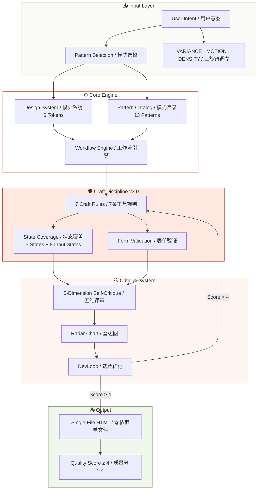
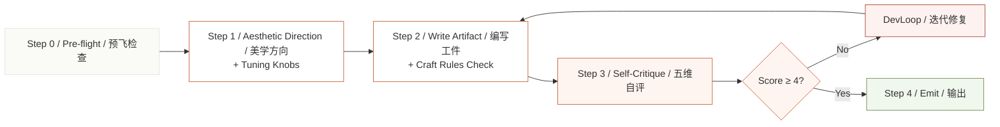
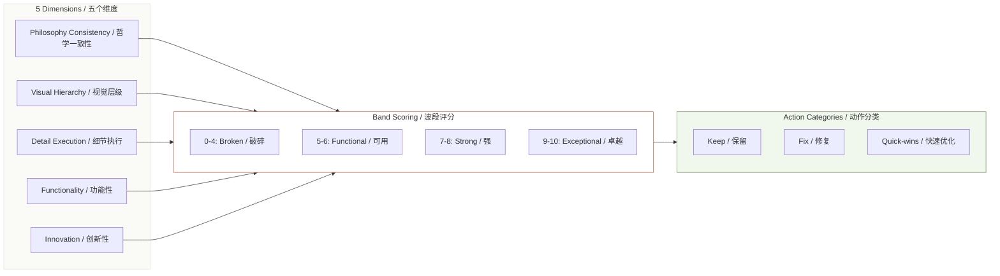
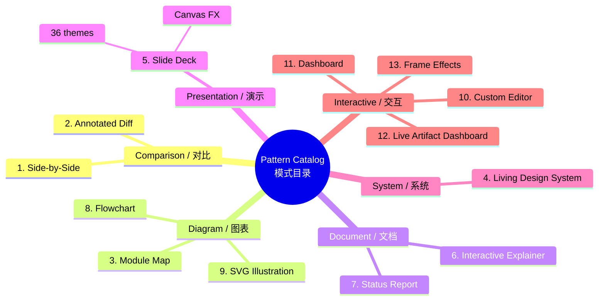

---
AIGC:
    Label: "1"
    ContentProducer: 001191440300708461136T1XGW3
    ProduceID: 263ae02d9b82b898f7b6446bc49bf3dd_cdb0659373c711f1b2f55254006c9bbf
    ReservedCode1: 5+W58LIUDfkzJOe2295qMidlVIzvAsGg3Jgop3jQgGj8EPka+FH3863e6+AxwFF71iWOYvecwKC0PMj88orvkBiU+x7LkXxDMMxTyvRJat+FnkJIbTunFxfaF7LvpTvH6gSGgMVz/4lZurKWaEckqBhMWevffPeAmg5N+PGL/RfXCivDKv5aG57Xa+0=
    ContentPropagator: 001191440300708461136T1XGW3
    PropagateID: 263ae02d9b82b898f7b6446bc49bf3dd_cdb0659373c711f1b2f55254006c9bbf
    ReservedCode2: 5+W58LIUDfkzJOe2295qMidlVIzvAsGg3Jgop3jQgGj8EPka+FH3863e6+AxwFF71iWOYvecwKC0PMj88orvkBiU+x7LkXxDMMxTyvRJat+FnkJIbTunFxfaF7LvpTvH6gSGgMVz/4lZurKWaEckqBhMWevffPeAmg5N+PGL/RfXCivDKv5aG57Xa+0=
---

# html-effectiveness / HTML 效能

> **Trade documents people skim for documents people actually read.**
> **把人们略读的文档变成人们真正会阅读的文档。**

A skill for generating beautiful, self-contained, single-file HTML artifacts. No build step. No dependencies. Open directly in a browser.

一个用于生成美观、自包含、单文件 HTML 工件的技能。无需构建步骤，零依赖，直接在浏览器中打开。

[](https://github.com/YardonYan/html-skill-effectiveness)
[](LICENSE.txt)

---

## Architecture Overview / 架构总览



---

## Workflow Pipeline / 工作流管道



---

## Critique System Architecture / 评审系统架构



---

## Pattern Catalog Map / 模式目录图



---

## What This Is / 这是什么

AI defaults to Markdown. Markdown is linear text — great for reading sequentially, terrible for:

AI 默认使用 Markdown。Markdown 是线性文本——适合顺序阅读，但不适合：

- Side-by-side comparisons / 并排对比
- Architecture diagrams / 架构图
- Interactive explainers / 交互式讲解
- Data dashboards / 数据仪表盘
- Slide decks / 幻灯片
- Code diffs with annotations / 带注释的代码差异

**HTML can do all of these.** This skill teaches AI how to generate them well.

**HTML 可以做到所有这些。** 这个技能教会 AI 如何生成高质量的 HTML 输出。

Every artifact is / 每个工件：
- **Single file / 单文件** — inline CSS and JavaScript, zero external dependencies / 内联 CSS 和 JavaScript，零外部依赖
- **Self-contained / 自包含** — open in any browser, no server needed / 在任何浏览器中打开，无需服务器
- **Visually polished / 视觉精美** — design system, typography, spacing, color tokens / 设计系统、字体、间距、色彩令牌
- **Pattern-based / 基于模式** — 13 proven patterns for common AI output scenarios / 13 种经过验证的模式，覆盖常见 AI 输出场景

---

## Changelog / 更新日志

### v3.0 (2026-06-29) — Craft Discipline Revolution / 工艺纪律革命

**新增：**
- 7 条可检查工艺规则（Anti-AI-Slop / Color / Typography / Typography Hierarchy / Animation / Accessibility / UX Laws），全部基于一手研究并引用来源
- 状态覆盖契约（5 种必须 UI 状态：Loading / Empty / Error / Populated / Edge）
- 表单验证状态机（8 种输入状态 + 4 条验证时序规则）
- 三旋钮调参接口（VARIANCE / MOTION / DENSITY），用户可通过参数微调输出风格
- 美学方向品牌参照锚定，每个方向附带 1-2 个真实品牌参考
- 适用边界声明，明确 Skill 不适用于需要身份验证/支付/后端逻辑的场景

**优化：**
- SKILL.md 结构瘦身（1421 行 → ~400 行），核心规则自包含，详细资料移至 references/
- P0 反模式从 10 条增至 15 条（新增：大写字母字距、展示文字负字距、serif 标题一致性、圆角卡片+彩色左边框、:user-invalid）
- P1 反模式新增 6 条（标准模板、外部占位图 CDN、强调色使用频率、装饰动画、outline 移除、过早验证）
- Accent Discipline 规则精确化：从"每屏 2 次"改为"每个视觉区域 2 次"
- Pattern Catalog 增加内联定义，AI 无需跳转 references 即可理解模式意图
- Craft Rule 3 (Typography) 增加 letter-spacing 强制规则和 three-weight 系统
- Craft Rule 5 (Animation) 增加 duration 阈值表、curve vs spring 选择、动画决策树
- Craft Rule 6 (Accessibility) 增加 WCAG 法律底线（EU/US 司法管辖区）、ARIA 纪律、TTT 注解
- Craft Rule 7 (Laws of UX) 从 26 条一手研究中提炼可执行指令
- 动画反常识修正（Skeleton 11% 更快 = FALSE，Doherty 400ms = FALSE，M3 curve 标注错误）

**修复：**
- 6 令牌哲学与 16 色完整板冲突 → 统一为 6 令牌，完整板移至 references/palette-examples.md
- Frontend Aesthetics Guidelines 与 Craft Rules 内容重复 → 删除重复段落
- 模式之间缺少组合指导 → Decision Flow 增加跨模式组合规则

### v2.1 (2026-05-21) — Critique & Iteration / 评审与迭代

**新增：**
- 五维自评审系统（哲学一致性 / 视觉层级 / 细节执行 / 功能性 / 创新性）+ 雷达图可视化
- DevLoop 迭代精炼机制（评审 → 修复 → 重复，最多 3 轮）
- Pattern #12 Live Artifact Dashboard（实时仪表盘，模板+数据分离架构）
- Pattern #13 Frame Effects（电影级视觉特效：Glitch 标题、Liquid 背景、Light Leak 等）
- 评分纪律规则（禁止平均、禁止膨胀、基于证据）

**优化：**
- Pattern #5 Slide Deck 增强（演讲者备注 `<aside class="notes">`、键盘导航、进度指示器）
- 5 维度评分从简单的 1-10 改为波段制（0-4 Broken / 5-6 Functional / 7-8 Strong / 9-10 Exceptional）

### v2.0 (2026-05-20) — Integration / 整合

**新增：**
- 6 令牌设计系统（--bg / --surface / --fg / --muted / --border / --accent）
- 11 种空间表达模式
- P0/P1/P2 三级反模式质量体系

**来源整合：**
- html-effectiveness by Thariq Shihipar（模式库基础）
- frontend-design by Anthropic（美学哲学）
- open-design by OpenDesign（工程严谨性）

### v1.0 (2026-05) — Initial / 初始版本

**新增：**
- 基于 html-effectiveness 的初始模式库
- 单文件零依赖 HTML 生成工作流
- 基础设计系统和排版规则

---

## Installation / 安装

### For OpenClaw

```bash
# Copy to your workspace skills directory
cp -r html-skill-effectiveness ~/.qclaw/skills/
```

Or use the SkillHub / 或使用 SkillHub：
```bash
openclaw skill install html-effectiveness
```

### For Claude (Claude Code)

```bash
# Copy to Claude skills directory
cp -r html-skill-effectiveness ~/.claude/skills/
```

---

## Pattern Catalog / 模式目录

> **Craft Rules apply to ALL patterns.** Before emitting any pattern, run through the Craft Rules checklist. No pattern is exempt from P0 rules.
> **工艺规则适用于所有模式。** 在输出任何模式前，必须通过工艺规则检查清单。无模式可豁免 P0 规则。

| # | Pattern / 模式 | Use For / 用于 |
|---|---------|---------|
| 1 | **Side-by-Side Comparison / 并排对比** | Tech choices, design options, trade-offs / 技术选型、设计选项、权衡 |
| 2 | **Annotated Diff / 代码审查** | PR reviews, code changes, before/after / PR 评审、代码变更、前后对比 |
| 3 | **Module Map / 模块地图** | Architecture diagrams, data flow / 架构图、数据流 |
| 4 | **Living Design System / 设计系统** | Color palettes, typography, component catalogs / 色板、字体、组件目录 |
| 5 | **Slide Deck / 幻灯片** | Presentations, walkthroughs, demos / 演示、讲解、演示 |
| 6 | **Interactive Explainer / 交互式讲解** | Teaching concepts, documentation / 教学概念、文档 |
| 7 | **Status Report / 状态报告** | Weekly updates, incident reports / 周报、事故报告 |
| 8 | **Flowchart / 流程图** | Pipelines, decision trees, workflows / 流水线、决策树、工作流 |
| 9 | **SVG Illustration / SVG 插图** | Blog diagrams, figures, icons / 博客图表、图形、图标 |
| 10 | **Custom Editor / 自定义编辑器** | Triage boards, prompt tuning, configuration / 看板、提示调优、配置 |
| 11 | **Dashboard / 仪表盘** | Metrics, KPIs, monitoring views / 指标、KPI、监控视图 |
| 12 | **Live Artifact Dashboard / 实时工件仪表盘** | Refreshable dashboards with template+data / 可刷新仪表盘，模板+数据架构 |
| 13 | **Frame Effects / 视觉特效** | Cinematic visual moments / 电影级视觉时刻 |

---

## Design System / 设计系统

### Core Tokens (6 variables) / 核心令牌（6 个变量）

```css
:root {
  --bg:      #fafaf7;   /* page background / 页面背景 */
  --surface: #ffffff;   /* cards, panels / 卡片、面板 */
  --fg:      #1a1916;   /* primary text / 主文本 */
  --muted:   #6b6964;   /* secondary text / 次要文本 */
  --border:  #e8e5df;   /* dividers / 分隔线 */
  --accent:  #c96442;   /* one accent, max 2× per visual region / 强调色，每个视觉区域最多 2 次 */
}
```

Everything else derives from these via `color-mix()`. No raw hex outside `:root`.

其他所有颜色都通过 `color-mix()` 派生。`:root` 外禁止使用原始十六进制色值。

### Typography / 字体

| Element / 元素 | Font / 字体 | Size / 大小 |
|---------|------|------|
| H1 | Display serif | clamp(44px, 6vw, 76px) |
| H2 | Display serif | clamp(32px, 4vw, 48px) |
| Body / 正文 | System sans | 16px |
| Code / 代码 | Mono | 13px |
| Eyebrow / 标签 | Mono | 11px, uppercase |

**Use system font fallback chains.** Prioritize built-in system fonts over external Google Fonts.

**优先使用系统字体 fallback 链。** 优先使用系统内置字体而非外部 Google 字体。

---

## Workflow / 工作流

### Step 0 — Pre-flight / 预飞检查
1. Read SKILL.md end-to-end / 从头到尾阅读 SKILL.md
2. Understand user's intent / 理解用户意图
3. Map to Pattern Catalog / 映射到模式目录
4. Plan section list / 规划章节列表

### Step 1 — Choose Aesthetic Direction / 选择美学方向
- Purpose, Tone, Constraints, Differentiation / 目的、调性、约束、差异化
- **Tuning Knobs / 三旋钮调参**: VARIANCE (1-10) / MOTION (1-10) / DENSITY (1-10), default 5
- **Brand Anchors / 品牌参照**: Each direction has 1-2 real brand references

### Step 2 — Write the Artifact / 编写工件
- Copy HTML Structure Template / 复制 HTML 结构模板
- Define 6 tokens in `:root` / 在 `:root` 中定义 6 令牌
- Build sections from Pattern Catalog / 从模式目录构建章节
- Run Craft Rules check / 运行工艺规则检查

### Step 3 — Critique / 评审
- Run 5-Dimension Self-Critique / 运行五维自评
- Band scoring (0-10) per dimension / 每维度波段评分（0-10）
- Generate Keep/Fix/Quick-wins report / 生成 Keep/Fix/Quick-wins 报告

### Step 4 — DevLoop / 迭代优化
- Apply Keep items / 保留 Keep 项
- Address Fix items / 处理 Fix 项
- Re-score after fixes / 修复后重新评分
- Max 3 iterations / 最多 3 轮

### Step 5 — Emit / 输出
```
<artifact identifier="slug" type="text/html" title="Title">
<!doctype html>
<html>...</html>
</artifact>
```

---

## Quality Standards / 质量标准

### P0 — Must Never Happen (15 items) / 绝对不能发生（15 条）
1. No external CSS/JS files / 禁止外部 CSS/JS 文件
2. No CDN libraries / 禁止 CDN 库
3. No raw hex outside `:root` / `:root` 外禁止原始十六进制
4. No purple/violet/indigo gradient backgrounds / 禁止紫色/紫罗兰/靛蓝渐变背景
5. No default Tailwind indigo (`#6366f1`, `#8b5cf6`) as accent / 禁止默认 Tailwind 靛蓝作强调色
6. No emoji as feature icons / 禁止用表情符号作为功能图标
7. No invented metrics / 禁止虚构指标
8. No filler copy / 禁止填充文本
9. `data-od-id` on every `<section>` / 每个 `<section>` 必须有 `data-od-id`
10. Mobile reflow works (≤920px) / 移动端重排正常（≤920px）
11. ALL CAPS must have `letter-spacing` ≥ `0.06em` / 大写字母必须有字距
12. Display text (≥32px) must have negative tracking / 展示文字必须有负字距
13. Display text must use `var(--font-display)`, not system-sans / 展示文字必须使用 `var(--font-display)`
14. No rounded card + colored left-border accent / 禁止圆角卡片+彩色左边框
15. Style off `:user-invalid`, not `:invalid` / 用 `:user-invalid` 而非 `:invalid`

### P1 — Should Avoid (10 items) / 应该避免（10 条）
- Walls of text / 文字墙
- Pure black/white / 纯黑/纯白
- Over-animation (max 500ms non-cross-screen) / 过度动画
- Generic AI aesthetics / 通用 AI 美学
- Inter/Roboto as display fonts / Inter/Roboto 作为展示字体
- Standard Hero→Features→Pricing→FAQ→CTA without variation / 无变化的标准模板
- External placeholder image CDNs / 外部占位图 CDN
- `var(--accent)` used 6+ times (cap: 2 per visual region) / 强调色每个视觉区域超过 2 次
- `outline: none` without replacement / 无替代的 focus outline 移除
- Validate on first keystroke / 首次击键就验证

### Scoring Discipline / 评分纪律
- **No averaging / 禁止平均**: each dimension scored independently / 每维度独立评分
- **No inflation / 禁止膨胀**: 7+ requires exceptional evidence / 7+ 需要非凡证据
- **Evidence-cited / 基于证据**: every score must cite specific observations / 每分必须引用具体观察

---

## File Structure / 文件结构

```
html-skill-effectiveness/
├── SKILL.md                    # Core skill definition (v3.0) / 核心技能定义
├── README.md                   # This file / 本文件
├── LICENSE.txt                 # Apache 2.0
├── BLOG.md                     # Detailed blog post / 详细博客文章
├── INTEGRATION_SUMMARY.md      # Version integration history / 版本整合历史
├── RELEASE-v3.0.md             # v3.0 release notes / v3.0 发布说明
├── indexxxxxxx_en.html         # English showcase / 英文展示页
├── indexxxxxxx_zh.html         # Chinese showcase / 中文展示页
└── references/
    ├── pattern-examples.md     # Code snippets by pattern / 按模式的代码片段
    ├── complete-examples.md    # Full HTML examples / 完整 HTML 示例
    ├── critique-guide.md       # Complete critique system guide / 完整评审系统指南
    ├── frame-effects.md        # Frame Effects pattern reference / 视觉特效模式参考
    ├── craft-rules-reference.md # Craft rules quick reference / 工艺规则快速参考
    ├── palette-examples.md     # 16色完整板 + 4替代方案 / 16-color palette + 4 alternatives
    ├── style-recipes.md        # 美学方向×品牌参照映射表 / Aesthetic direction × brand reference map
    ├── presenter-mode.md       # BroadcastChannel 双窗口演讲者模式 / Dual-window presenter mode
    ├── ux-laws-reference.md    # 26条UX法则完整版 / Complete 26 UX laws
    ├── accessibility-detail.md # WCAG合规细节 / WCAG compliance details
    └── device-frames.md        # CSS设备外框代码 / CSS device frame code
```

---

## Example Prompts / 示例提示

- "Generate a status report as HTML" / "生成 HTML 状态报告"
- "Make this comparison visual with HTML" / "用 HTML 让这个对比可视化"
- "Create an interactive explainer for [concept]" / "为 [概念] 创建交互式讲解"
- "Build a slide deck about [topic]" / "制作关于 [主题] 的幻灯片"
- "Design a triage board for these tickets" / "为这些工单设计看板"
- "Draw a flowchart of this process" / "绘制这个流程的流程图"
- "Show me component variants in HTML" / "在 HTML 中展示组件变体"
- "Make this HTML prettier / more professional" / "让这个 HTML 更美观/更专业"
- "Create a dashboard for [metrics] --variance=7 --motion=4 --density=5" / "为 [指标] 创建仪表盘"
- "Make a presentation with speaker notes" / "制作带演讲者备注的演示"
- "Critique this HTML output and suggest improvements" / "评审这个 HTML 输出并建议改进"
- "Add a live artifact dashboard with refreshable data" / "添加带可刷新数据的实时仪表盘"
- "Apply frame effects to make this page cinematic" / "应用视觉特效让页面更具电影感"

---

## Credits / 致谢

- **Original concept / 原版概念**: [The Unreasonable Effectiveness of HTML](https://github.com/ThariqS/html-effectiveness) by Thariq Shihipar
- **Aesthetic philosophy / 美学哲学**: [frontend-design](https://github.com/anthropics/skills/tree/main/skills/frontend-design) by Anthropic
- **Craft discipline system / 工艺纪律系统**: [open-design](https://github.com/opendesign) by OpenDesign — anti-ai-slop, color, typography, typography-hierarchy, animation-discipline, accessibility-baseline, laws-of-ux, state-coverage, form-validation craft rules / 反AI味、色彩、排版、排版层级、动画纪律、可访问性底线、UX法则、状态覆盖、表单验证工艺规则
- **PPT/Slide enhancement / PPT/幻灯片增强**: [html-ppt](https://github.com/opendesign) — 36 themes, 31 layouts, canvas FX / 36 套主题、31 种布局、Canvas FX
- **Integration & enhancement / 整合与增强**: [Yardon](https://github.com/YardonYan)

---

## License / 许可证

Apache 2.0 — see [LICENSE.txt](LICENSE.txt)
*（内容由AI生成，仅供参考）*
