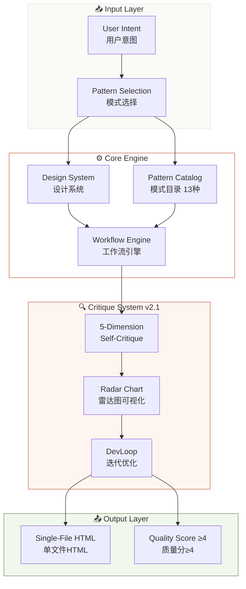
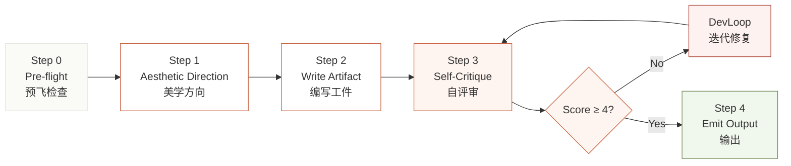
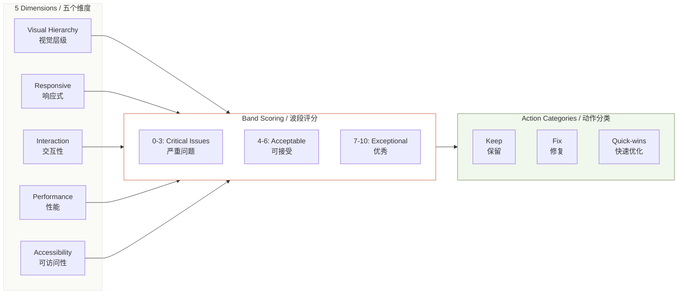
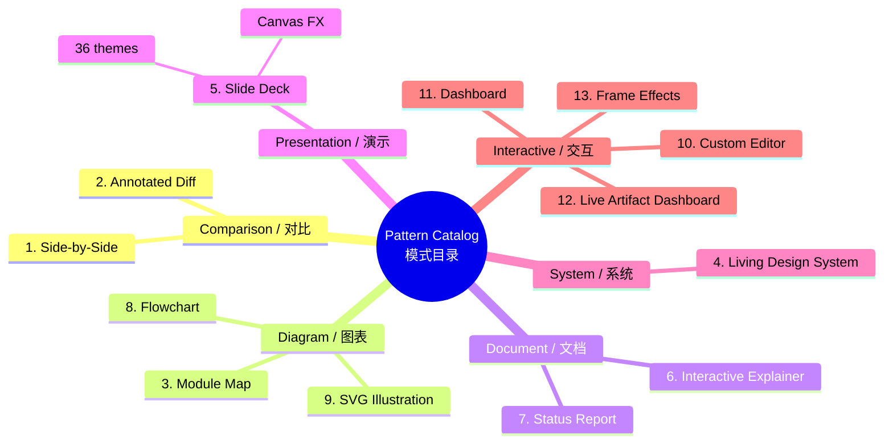

# html-effectiveness / HTML 效能

> **Trade documents people skim for documents people actually read.**
> **把人们略读的文档变成人们真正会阅读的文档。**

A skill for generating beautiful, self-contained, single-file HTML artifacts. No build step. No dependencies. Open directly in a browser.

一个用于生成美观、自包含、单文件 HTML 工件的技能。无需构建步骤，零依赖，直接在浏览器中打开。

[](https://github.com/YardonYan/html-skill-effectiveness)
[](LICENSE.txt)

---

## Architecture Overview / 架构总览



---

## Workflow Pipeline / 工作流管道



---

## Critique System Architecture / 评审系统架构



---

## Pattern Catalog Map / 模式目录图



---

## What This Is / 这是什么

AI defaults to Markdown. Markdown is linear text — great for reading sequentially, terrible for:

AI 默认使用 Markdown。Markdown 是线性文本——适合顺序阅读，但不适合：

- Side-by-side comparisons / 并排对比
- Architecture diagrams / 架构图
- Interactive explainers / 交互式讲解
- Data dashboards / 数据仪表盘
- Slide decks / 幻灯片
- Code diffs with annotations / 带注释的代码差异

**HTML can do all of these.** This skill teaches AI how to generate them well.

**HTML 可以做到所有这些。** 这个技能教会 AI 如何生成高质量的 HTML 输出。

Every artifact is / 每个工件：
- **Single file / 单文件** — inline CSS and JavaScript, zero external dependencies / 内联 CSS 和 JavaScript，零外部依赖
- **Self-contained / 自包含** — open in any browser, no server needed / 在任何浏览器中打开，无需服务器
- **Visually polished / 视觉精美** — design system, typography, spacing, color tokens / 设计系统、字体、间距、色彩令牌
- **Pattern-based / 基于模式** — 13 proven patterns for common AI output scenarios / 13 种经过验证的模式，覆盖常见 AI 输出场景

---

## What's New in v2.1 / v2.1 新特性

> "From generate once to generate, critique, refine, converge."
> "从一次生成到生成、评审、优化、收敛。"

v2.1 introduces the **Critique Revolution** — the skill no longer just generates HTML and hopes for the best. It now systematically critiques its own output across 5 dimensions using radar chart visualization, band scoring (0-10), and evidence-cited judgments, then iterates via a **DevLoop** until quality converges (score ≥ 4).

v2.1 引入了**评审革命**——这个技能不再只是生成 HTML 然后听天由命。它现在通过雷达图可视化、波段评分（0-10）和基于证据的判断，系统地评审自己的输出，然后通过 **DevLoop** 迭代直到质量收敛（分数 ≥ 4）。

### New Features / 新功能

- **Enhanced Critique System / 增强评审系统** — Radar chart visualization, band scoring (0-10), Keep/Fix/Quick-wins categorization with evidence-cited reasoning. / 雷达图可视化、波段评分（0-10）、Keep/Fix/Quick-wins 分类，附带基于证据的推理。
- **DevLoop: Iterative Self-Improvement / DevLoop：迭代自我改进** — critique → fix → repeat until score ≥ 4. / 评审 → 修复 → 重复直到分数 ≥ 4。
- **2 New Patterns / 2 个新模式** — Live Artifact Dashboard (#12) and Frame Effects (#13). / 实时工件仪表盘（#12）和视觉特效（#13）。
- **Enhanced PPT/Slide Pattern / 增强 PPT/幻灯片模式** — 36 themes, 31 layouts, 15 full-deck templates, 27 CSS animations, 20 Canvas FX. / 36 套主题、31 种布局、15 个全 deck 模板、27 种 CSS 动画、20 种 Canvas FX。
- **Scoring Discipline Rules / 评分纪律规则** — Anti-inflation: no averaging, no score inflation. / 反膨胀：禁止平均、禁止评分膨胀。
- **Critique Report Output Contract / 评审报告输出契约** — Standardized critique report format. / 标准化评审报告格式。

---

## Installation / 安装

### For OpenClaw

```bash
# Copy to your workspace skills directory
cp -r html-skill-effectiveness ~/.qclaw/skills/
```

Or use the SkillHub / 或使用 SkillHub：
```bash
openclaw skill install html-effectiveness
```

### For Claude (Claude Code)

```bash
# Copy to Claude skills directory
cp -r html-skill-effectiveness ~/.claude/skills/
```

---

## Pattern Catalog / 模式目录

| # | Pattern / 模式 | Use For / 用于 |
|---|---------|---------|
| 1 | **Side-by-Side Comparison / 并排对比** | Tech choices, design options, trade-offs / 技术选型、设计选项、权衡 |
| 2 | **Annotated Diff / 代码审查** | PR reviews, code changes, before/after / PR 评审、代码变更、前后对比 |
| 3 | **Module Map / 模块地图** | Architecture diagrams, data flow / 架构图、数据流 |
| 4 | **Living Design System / 设计系统** | Color palettes, typography, component catalogs / 色板、字体、组件目录 |
| 5 | **Slide Deck / 幻灯片** | Presentations, walkthroughs, demos / 演示、讲解、演示 |
| 6 | **Interactive Explainer / 交互式讲解** | Teaching concepts, documentation / 教学概念、文档 |
| 7 | **Status Report / 状态报告** | Weekly updates, incident reports / 周报、事故报告 |
| 8 | **Flowchart / 流程图** | Pipelines, decision trees, workflows / 流水线、决策树、工作流 |
| 9 | **SVG Illustration / SVG 插图** | Blog diagrams, figures, icons / 博客图表、图形、图标 |
| 10 | **Custom Editor / 自定义编辑器** | Triage boards, prompt tuning, configuration / 看板、提示调优、配置 |
| 11 | **Dashboard / 仪表盘** | Metrics, KPIs, monitoring views / 指标、KPI、监控视图 |
| 12 | **Live Artifact Dashboard / 实时工件仪表盘** | Refreshable dashboards with template+data / 可刷新仪表盘，模板+数据架构 |
| 13 | **Frame Effects / 视觉特效** | Cinematic visual moments / 电影级视觉时刻 |

---

## Design System / 设计系统

### Core Tokens (6 variables) / 核心令牌（6 个变量）

```css
:root {
  --bg:      #fafaf7;   /* page background / 页面背景 */
  --surface: #ffffff;   /* cards, panels / 卡片、面板 */
  --fg:      #1a1916;   /* primary text / 主文本 */
  --muted:   #6b6964;   /* secondary text / 次要文本 */
  --border:  #e8e5df;   /* dividers / 分隔线 */
  --accent:  #c96442;   /* one accent, max 2× per screen / 强调色，每屏最多 2 次 */
}
```

Everything else derives from these via `color-mix()`. No raw hex outside `:root`.

其他所有颜色都通过 `color-mix()` 派生。`:root` 外禁止使用原始十六进制色值。

### Typography / 字体

| Element / 元素 | Font / 字体 | Size / 大小 |
|---------|------|------|
| H1 | Display serif | clamp(44px, 6vw, 76px) |
| H2 | Display serif | clamp(32px, 4vw, 48px) |
| Body / 正文 | System sans | 16px |
| Code / 代码 | Mono | 13px |
| Eyebrow / 标签 | Mono | 11px, uppercase |

**No Inter/Roboto/Arial as display fonts.** Choose distinctive, beautiful typefaces.

**禁止将 Inter/Roboto/Arial 用作展示字体。** 选择独特、美观的字体。

---

## Workflow / 工作流

### Step 0 — Pre-flight / 预飞检查
1. Read SKILL.md end-to-end / 从头到尾阅读 SKILL.md
2. Understand user's intent / 理解用户意图
3. Map to Pattern Catalog / 映射到模式目录
4. Plan section list / 规划章节列表

### Step 1 — Choose Aesthetic Direction / 选择美学方向
- Purpose, Tone, Constraints, Differentiation / 目的、调性、约束、差异化

### Step 2 — Write the Artifact / 编写工件
- Copy HTML Structure Template / 复制 HTML 结构模板
- Define tokens in `:root` / 在 `:root` 中定义令牌
- Build sections from Pattern Catalog / 从模式目录构建章节

### Step 3 — Critique / 评审 (NEW in v2.1 / v2.1 新增)
- Run 5-Dimension Self-Critique / 运行五维自评
- Band scoring (0-10) per dimension / 每维度波段评分（0-10）
- Generate Keep/Fix/Quick-wins report / 生成 Keep/Fix/Quick-wins 报告

### Step 4 — DevLoop / DevLoop (NEW in v2.1 / v2.1 新增)
- Apply Keep items / 保留 Keep 项
- Address Fix items / 处理 Fix 项
- Re-score after fixes / 修复后重新评分

### Step 5 — Emit / 输出
```
<artifact identifier="slug" type="text/html" title="Title">
<!doctype html>
<html>...</html>
</artifact>
```

---

## Quality Standards / 质量标准

### P0 — Must Never Happen / 绝对不能发生
- No external CSS/JS files / 禁止外部 CSS/JS 文件
- No CDN libraries / 禁止 CDN 库
- No raw hex outside `:root` / `:root` 外禁止原始十六进制
- No purple/violet gradient backgrounds / 禁止紫色/紫罗兰渐变背景
- No emoji as feature icons / 禁止用表情符号作为功能图标
- No invented metrics / 禁止虚构指标
- No filler copy / 禁止填充文本
- `data-od-id` on every `<section>` / 每个 `<section>` 必须有 `data-od-id`
- Mobile reflow works (≤920px) / 移动端重排正常（≤920px）

### P1 — Should Avoid / 应该避免
- Walls of text / 文字墙
- Pure black/white / 纯黑/纯白
- Over-animation / 过度动画
- Generic AI aesthetics / 通用 AI 美学
- Inter/Roboto as display fonts / Inter/Roboto 作为展示字体

### Scoring Discipline (NEW in v2.1) / 评分纪律（v2.1 新增）
- **No averaging / 禁止平均**: each dimension scored independently / 每维度独立评分
- **No inflation / 禁止膨胀**: 7+ requires exceptional evidence / 7+ 需要非凡证据
- **Evidence-cited / 基于证据**: every score must cite specific observations / 每分必须引用具体观察

---

## File Structure / 文件结构

```
html-skill-effectiveness/
├── SKILL.md                    # Core skill definition / 核心技能定义
├── README.md                   # This file / 本文件
├── LICENSE.txt                 # Apache 2.0
├── BLOG.md                     # Detailed blog post / 详细博客文章
├── INTEGRATION_SUMMARY.md      # Version integration history / 版本整合历史
├── indexxxxxxx_en.html         # English showcase / 英文展示页
├── indexxxxxxx_zh.html         # Chinese showcase / 中文展示页
└── references/
    ├── pattern-examples.md     # Code snippets by pattern / 按模式的代码片段
    ├── complete-examples.md    # Full HTML examples / 完整 HTML 示例
    ├── critique-guide.md       # Complete critique system guide / 完整评审系统指南
    └── frame-effects.md        # Frame Effects pattern reference / 视觉特效模式参考
```

---

## Example Prompts / 示例提示

- "Generate a status report as HTML" / "生成 HTML 状态报告"
- "Make this comparison visual with HTML" / "用 HTML 让这个对比可视化"
- "Create an interactive explainer for [concept]" / "为 [概念] 创建交互式讲解"
- "Build a slide deck about [topic]" / "制作关于 [主题] 的幻灯片"
- "Design a triage board for these tickets" / "为这些工单设计看板"
- "Draw a flowchart of this process" / "绘制这个流程的流程图"
- "Show me component variants in HTML" / "在 HTML 中展示组件变体"
- "Make this HTML prettier / more professional" / "让这个 HTML 更美观/更专业"
- "Create a dashboard for [metrics]" / "为 [指标] 创建仪表盘"
- "Make a presentation with speaker notes" / "制作带演讲者备注的演示"
- "Critique this HTML output and suggest improvements" / "评审这个 HTML 输出并建议改进"
- "Add a live artifact dashboard with refreshable data" / "添加带可刷新数据的实时仪表盘"
- "Apply frame effects to make this page cinematic" / "应用视觉特效让页面更具电影感"

---

## Credits / 致谢

- **Original concept / 原版概念**: [The Unreasonable Effectiveness of HTML](https://github.com/ThariqS/html-effectiveness) by Thariq Shihipar
- **Aesthetic philosophy / 美学哲学**: [frontend-design](https://github.com/anthropics/skills/tree/main/skills/frontend-design) by Anthropic
- **Engineering rigor & critique system / 工程严谨性与评审系统**: [open-design](https://github.com/opendesign) by OpenDesign
- **PPT/Slide enhancement / PPT/幻灯片增强**: [html-ppt](https://github.com/opendesign) — 36 themes, 31 layouts, canvas FX / 36 套主题、31 种布局、Canvas FX
- **Integration & enhancement / 整合与增强**: [Yardon](https://github.com/YardonYan)

---

## License / 许可证

Apache 2.0 — see [LICENSE.txt](LICENSE.txt)
