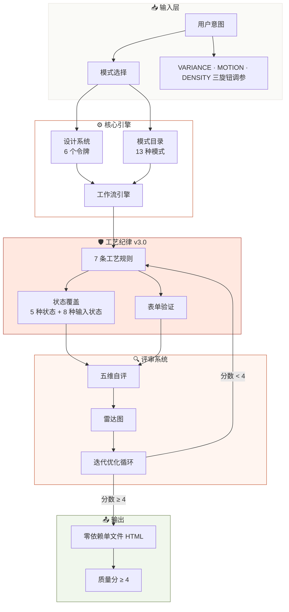
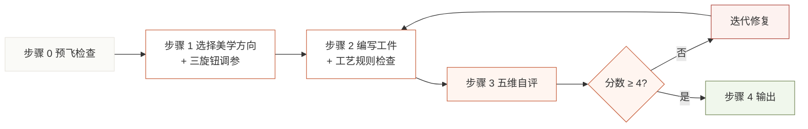
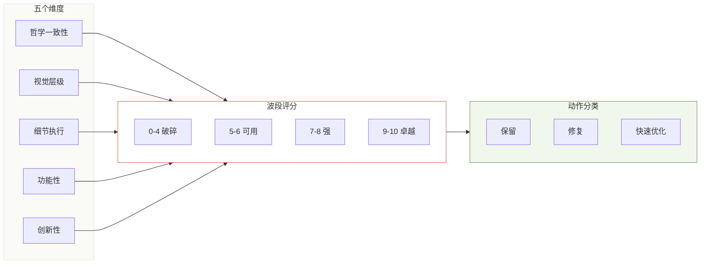
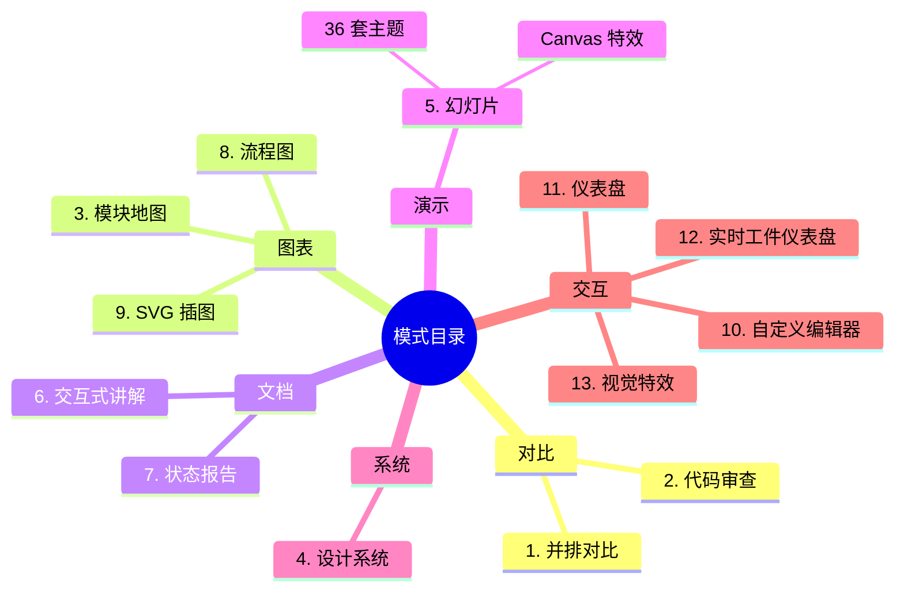

<div align="center">


**把人们略读的文档，变成人们真正会阅读的文档**

[](LICENSE)
[](docs/RELEASE-v3.0.md)
[](https://github.com/YardonYan/html-skill-effectiveness)
[](#安装)
[](#模式目录)
[](#设计系统)

**中文** · [English](README.en.md)

</div>

---

> 把人们略读的文档变成人们真正会阅读的文档。

AI 很擅长写 Markdown。但 Markdown 是线性的、表达力有限——表格和加粗文字能做的就到这了。这个技能教 AI 输出**真正的 HTML 页面**：让权衡一目了然的并排对比、可缩放点击的架构图、带演讲者备注的幻灯片、实时更新的数据仪表盘。

和「帮我写个 HTML 页面」有什么区别？三点：

- **工艺规则**——7 条硬性规则在 AI 输出前拦截所有 AI 味（没有紫色渐变、没有假文案、没有虚构数字、强制执行可访问性标准）
- **自我评审**——AI 先给自己打分，5 个维度，不及格就回去改，通过了才交给你
- **零依赖**——每个工件就是单个 HTML 文件，全内联，任何浏览器直接打开，无需安装任何东西

兼容任何支持 skill 文件的 AI 助手：Claude Code、OpenClaw、Cursor、Windsurf 等均可使用。13 种实战验证的模式，当前版本 v3.0。

## 目录

- [架构总览](#架构总览)
- [工作流管道](#工作流管道)
- [评审系统](#评审系统)
- [模式目录](#模式目录)
- [这是什么](#这是什么)
- [安装](#安装)
- [在线演示](#在线演示)
- [设计系统](#设计系统)
- [工作流](#工作流)
- [质量标准](#质量标准)
- [文件结构](#文件结构)
- [示例提示](#示例提示)
- [排错](#排错)
- [版本历史](#版本历史)
- [致谢](#致谢)
- [许可证](#许可证)

---

<a id="架构总览"></a>

## 架构总览


```mermaid
graph TB
    subgraph Input["📥 输入层"]
        U[用户意图]
        P[模式选择]
        KN[VARIANCE · MOTION · DENSITY 三旋钮调参]
    end

    subgraph Core["⚙️ 核心引擎"]
        DS[设计系统<br/>6 个令牌]
        PC[模式目录<br/>13 种模式]
        WF[工作流引擎]
    end

    subgraph Craft["🛡️ 工艺纪律 v3.0"]
        CR[7 条工艺规则]
        SC[状态覆盖<br/>5 种状态 + 8 种输入状态]
        FV[表单验证]
    end

    subgraph Critique["🔍 评审系统"]
        C5[五维自评]
        RS[雷达图]
        DL[迭代优化循环]
    end

    subgraph Output["📤 输出"]
        H[零依赖单文件 HTML]
        Q[质量分 ≥ 4]
    end

    U --> P
    U --> KN
    P --> DS & PC
    DS & PC --> WF
    WF --> CR
    CR --> SC & FV
    SC & FV --> C5
    C5 --> RS --> DL
    DL -->|分数 < 4| CR
    DL -->|分数 ≥ 4| H
    H --> Q

    style Input fill:#fafaf7,stroke:#e8e5df
    style Core fill:#ffffff,stroke:#c96442
    style Craft fill:#ffe8e0,stroke:#b04a3f
    style Critique fill:#fff5f0,stroke:#c96442
    style Output fill:#f0f7ec,stroke:#788c5d
```

<a id="工作流管道"></a>

## 工作流管道


```mermaid
flowchart LR
    S0[步骤 0 预飞检查] --> S1
    S1[步骤 1 选择美学方向<br/>+ 三旋钮调参] --> S2
    S2[步骤 2 编写工件<br/>+ 工艺规则检查] --> S3
    S3[步骤 3 五维自评] --> S4{分数 ≥ 4?}
    S4 -->|否| S5[迭代修复]
    S5 --> S2
    S4 -->|是| S6[步骤 4 输出]

    style S0 fill:#fafaf7,stroke:#e8e5df
    style S1 fill:#ffffff,stroke:#c96442
    style S2 fill:#ffffff,stroke:#c96442
    style S3 fill:#fff5f0,stroke:#c96442
    style S4 fill:#fff5f0,stroke:#c96442
    style S5 fill:#fdf2f0,stroke:#b04a3f
    style S6 fill:#f0f7ec,stroke:#788c5d
```

<a id="评审系统"></a>

## 评审系统


```mermaid
graph LR
    subgraph Dimensions["五个维度"]
        D1[哲学一致性]
        D2[视觉层级]
        D3[细节执行]
        D4[功能性]
        D5[创新性]
    end

    subgraph Scoring["波段评分"]
        B1[0-4 破碎]
        B2[5-6 可用]
        B3[7-8 强]
        B4[9-10 卓越]
    end

    subgraph Action["动作分类"]
        K[保留]
        FX[修复]
        QW[快速优化]
    end

    D1 & D2 & D3 & D4 & D5 --> Scoring
    Scoring --> Action

    style Dimensions fill:#fafaf7,stroke:#e8e5df
    style Scoring fill:#ffffff,stroke:#c96442
    style Action fill:#f0f7ec,stroke:#788c5d
```

<a id="模式目录"></a>

## 模式目录


```mermaid
mindmap
  root((模式目录))
    对比
      1. 并排对比
      2. 代码审查
    图表
      3. 模块地图
      8. 流程图
      9. SVG 插图
    文档
      6. 交互式讲解
      7. 状态报告
    演示
      5. 幻灯片
        36 套主题
        Canvas 特效
    系统
      4. 设计系统
    交互
      10. 自定义编辑器
      11. 仪表盘
      12. 实时工件仪表盘
      13. 视觉特效
```

> **工艺规则适用于所有模式。** 输出任何模式前，必须通过工艺规则检查清单。没有任何模式可以豁免 P0 规则。

| # | 模式 | 用于 |
|---|------|------|
| 1 | **并排对比** | 技术选型、设计选项、权衡取舍 |
| 2 | **代码审查** | PR 评审、代码变更、前后对比 |
| 3 | **模块地图** | 架构图、数据流 |
| 4 | **设计系统** | 色板、字体、组件目录 |
| 5 | **幻灯片** | 演示、讲解、产品演示 |
| 6 | **交互式讲解** | 教学概念、文档 |
| 7 | **状态报告** | 周报、事故报告 |
| 8 | **流程图** | 流水线、决策树、工作流 |
| 9 | **SVG 插图** | 博客图表、配图、图标 |
| 10 | **自定义编辑器** | 分诊看板、提示调优、配置界面 |
| 11 | **仪表盘** | 指标、KPI、监控视图 |
| 12 | **实时工件仪表盘** | 模板 + 数据架构的可刷新仪表盘 |
| 13 | **视觉特效** | 电影级视觉时刻 |

---

<a id="这是什么"></a>

## 这是什么

AI 默认使用 Markdown。Markdown 是线性文本，适合顺序阅读，但不适合这些场景：

- 并排对比
- 架构图
- 交互式讲解
- 数据仪表盘
- 幻灯片
- 带注释的代码差异

**HTML 可以做到所有这些。** 这个技能教会 AI 如何把它们做好。

每个工件都是：

- **单文件**——内联 CSS 和 JavaScript，零外部依赖
- **自包含**——在任何浏览器中打开，无需服务器
- **视觉精美**——设计系统、字体、间距、色彩令牌
- **基于模式**——13 种经过验证的模式，覆盖常见 AI 输出场景

<a id="安装"></a>

## 安装

### 用安装器（推荐）

仓库自带一个零依赖的安装脚本，装到本机各个 AI 应用的 skills 目录，不需要手工拷贝：

```bash
node tools/install.mjs --list                 # 看有哪些目标可选
node tools/install.mjs --ai workbuddy         # 装到 WorkBuddy
node tools/install.mjs --ai all               # 装到全部目标
node tools/install.mjs --ai all --dry-run     # 只预览，不写文件
node tools/install.mjs --ai workbuddy --uninstall   # 卸载
```

已核对存在的目标：WorkBuddy、TRAE 国内版、CodeBuddy、Claude Code、Codex CLI、OpenClaw、Qwen Code、cc-switch。`cursor` 与通用 `.agents` 用的是通行约定，未在本机核对。

### 作为插件安装（WorkBuddy / CodeBuddy / Claude Code）

仓库根目录带 `.codebuddy-plugin/` 与 `.claude-plugin/` 两份清单，可以直接注册成一个「单插件市场」，在应用里按插件方式安装，不用手工拷目录。

清单的字段名与取值是照着应用自带的插件清单写的，不是自己发明的格式。**文件格式已逐字段对照应用自带的市场核对；注册与加载的端到端流程未做验证**，注册入口以你所装版本的界面为准。

改过 `SKILL.md` 的 name 或版本号之后重新生成：

```bash
node tools/build_plugins.mjs .
```

### 手工安装

```bash
git clone https://github.com/YardonYan/html-skill-effectiveness.git
```

或从 [Releases](https://github.com/YardonYan/html-skill-effectiveness/releases) 下载最新 ZIP。

**OpenClaw**

```bash
cp -r html-skill-effectiveness ~/.qclaw/skills/
```

或使用 SkillHub：

```bash
openclaw skill install html-effectiveness
```

**Claude Code**

```bash
cp -r html-skill-effectiveness ~/.claude/skills/
```

**Cursor / 其他 AI 工具**

核心就是一个 `SKILL.md` 文件，复制或软链到你所用工具加载规则的位置即可：

```bash
# Cursor：复制到 .cursorrules 或 Rules 目录
cp SKILL.md ~/.cursorrules/html-effectiveness.md
```

任何会读取 markdown 指令文件的 AI 编码助手都能用这个技能，只要把 `SKILL.md` 指向它即可。

<a id="在线演示"></a>

## 在线演示

| 演示 | 内容 |
|------|------|
| [完整模式展示](https://raw.githack.com/YardonYan/html-skill-effectiveness/main/docs/demo.html) | 13 种模式 + v3.0 状态覆盖、表单验证、三旋钮调参 |
| [模式展示（英文）](https://raw.githack.com/YardonYan/html-skill-effectiveness/main/docs/demo_en.html) | 英文版模式展示，含 v3.0 特性 |
| [模式展示（中文）](https://raw.githack.com/YardonYan/html-skill-effectiveness/main/docs/demo_zh.html) | 中文模式展示 + v3.0 特性 |
| [v2.1 演示（归档）](https://raw.githack.com/YardonYan/html-skill-effectiveness/main/docs/test-v21-demo.html) | v2.1 视觉特效 + 实时仪表盘归档 |

> 链接使用 raw.githack.com 直接渲染 HTML，首次加载可能需要几秒。

<a id="设计系统"></a>

## 设计系统

### 核心令牌（6 个变量）

```css
:root {
  --bg:      #fafaf7;   /* 页面背景 */
  --surface: #ffffff;   /* 卡片、面板 */
  --fg:      #1a1916;   /* 主文本 */
  --muted:   #6b6964;   /* 次要文本 */
  --border:  #e8e5df;   /* 分隔线 */
  --accent:  #c96442;   /* 唯一强调色，每个视觉区域最多 2 次 */
}
```

其他所有颜色都通过 `color-mix()` 从这 6 个令牌派生。`:root` 之外禁止出现原始十六进制色值。

### 字体

| 元素 | 字体 | 大小 |
|------|------|------|
| H1 | 展示衬线 | clamp(44px, 6vw, 76px) |
| H2 | 展示衬线 | clamp(32px, 4vw, 48px) |
| 正文 | 系统无衬线 | 16px |
| 代码 | 等宽 | 13px |
| 标签 | 等宽 | 11px，大写 |

优先使用系统字体 fallback 链，而非外部 Google 字体。

---

<a id="工作流"></a>

## 工作流

### 步骤 0——预飞检查

从头到尾阅读 `SKILL.md`，理解用户意图，映射到模式目录，规划章节列表。

### 步骤 1——选择美学方向

明确目的、调性、约束与差异化。通过**三旋钮调参**微调输出风格：VARIANCE（变化度）、MOTION（动效）、DENSITY（密度），取值 1-10，默认 5。每个美学方向都附带 1-2 个真实品牌参照。

### 步骤 2——编写工件

复制 HTML 结构模板，在 `:root` 中定义 6 个令牌，按模式目录构建章节，运行工艺规则检查。

### 步骤 3——评审

运行五维自评，每个维度按 0-10 波段评分，产出「保留 / 修复 / 快速优化」三类报告。

### 步骤 4——迭代优化

应用「保留」项，处理「修复」项，重新评分。最多迭代 3 轮。

### 步骤 5——输出

```
<artifact identifier="slug" type="text/html" title="标题">
<!doctype html>
<html>...</html>
</artifact>
```

<a id="质量标准"></a>

## 质量标准

### P0——绝对不能发生（15 条）

1. 禁止外部 CSS/JS 文件
2. 禁止 CDN 库
3. `:root` 之外禁止原始十六进制色值
4. 禁止紫色、紫罗兰或靛蓝渐变背景
5. 禁止把默认 Tailwind 靛蓝（`#6366f1`、`#8b5cf6`）用作强调色
6. 禁止用表情符号充当功能图标
7. 禁止虚构指标
8. 禁止填充文本
9. 每个 `<section>` 必须有 `data-od-id`
10. 移动端重排必须正常（≤920px）
11. 全大写文本必须带字距，`letter-spacing` ≥ `0.06em`
12. 展示文字（≥32px）必须使用负字距
13. 展示文字必须使用 `var(--font-display)`，不能用系统无衬线
14. 禁止「圆角卡片 + 彩色左边框」的组合
15. 表单校验用 `:user-invalid`，不用 `:invalid`

### P1——应该避免（10 条）

- 文字墙
- 纯黑或纯白
- 过度动画（非跨屏动画不超过 500ms）
- 通用 AI 美学
- 用 Inter / Roboto 充当展示字体
- 无变化的「Hero → Features → Pricing → FAQ → CTA」标准模板
- 外部占位图 CDN
- `var(--accent)` 使用超过 6 次（上限：每个视觉区域 2 次）
- 移除 `outline` 而不提供替代聚焦样式
- 首次击键就触发表单校验

### 评分纪律

- **禁止平均**——每个维度独立评分
- **禁止膨胀**——7 分以上需要非凡证据
- **基于证据**——每一个分数都必须引用具体观察

---

<a id="文件结构"></a>

## 文件结构

```
html-skill-effectiveness/
├── SKILL.md                     # 核心技能定义（v3.0）
├── .codebuddy-plugin/              插件清单（WorkBuddy / CodeBuddy）
├── .claude-plugin/                 插件清单（Claude Code）
├── README.md                    # 中文说明（本文件）
├── README.en.md                 # English README
├── LICENSE                      # Apache-2.0 许可证
├── assets/
│   └── hero.png                 # README 门面图
├── tools/
│   ├── gen_readme_images.py     # 生成 README 配图（Pillow）
│   └── build_plugins.mjs        # 生成插件清单
├── references/                  # 参考库
│   ├── pattern-examples.md      # 按模式分类的代码片段
│   ├── complete-examples.md     # 完整 HTML 示例
│   ├── craft-rules-reference.md # 工艺规则快速参考
│   ├── palette-examples.md      # 16 色完整板 + 4 套替代方案
│   ├── style-recipes.md         # 美学方向 × 品牌参照映射表
│   ├── presenter-mode.md        # BroadcastChannel 双窗口演讲者模式
│   ├── ux-laws-reference.md     # 26 条 UX 法则完整版
│   ├── accessibility-detail.md  # WCAG 合规细节
│   └── device-frames.md         # CSS 设备外框代码
└── docs/                        # 过程文档与演示
    ├── demo.html                # 完整模式展示
    ├── demo_en.html             # 英文展示页
    ├── demo_zh.html             # 中文展示页
    ├── test-v21-demo.html       # v2.1 演示归档
    ├── BLOG.md                  # 详细博客文章
    ├── INTEGRATION_SUMMARY.md   # 版本整合历史
    ├── RELEASE-v2.1.md          # v2.1 发布说明
    └── RELEASE-v3.0.md          # v3.0 发布说明
```

---

<a id="示例提示"></a>

## 示例提示

- 「生成一份 HTML 状态报告」
- 「用 HTML 让这个对比可视化」
- 「为 [概念] 创建交互式讲解」
- 「制作关于 [主题] 的幻灯片」
- 「为这些工单设计一个分诊看板」
- 「绘制这个流程的流程图」
- 「在 HTML 中展示组件变体」
- 「让这个 HTML 更美观 / 更专业」
- 「为 [指标] 创建仪表盘 --variance=7 --motion=4 --density=5」
- 「制作带演讲者备注的演示」
- 「评审这个 HTML 输出并给出改进建议」
- 「添加带可刷新数据的实时工件仪表盘」
- 「应用视觉特效，让这个页面更有电影感」

---

<a id="排错"></a>

## 排错

### 装好了但对话里没反应

按顺序查三件事：

一、**`SKILL.md` 是否在技能目录的根层。** 正确结构是 `<应用技能目录>/html-skill-effectiveness/SKILL.md`。如果多套了一层目录，应用扫不到。

二、**重启应用。** 多数应用只在启动时扫描技能目录。

三、**确认目录是该应用真正会扫的那个。** 跑 `node tools/install.mjs --list` 看清单。

### 对话里直接显示出 `<artifact ...>` 这段标签文字

技能默认用 `<artifact identifier="slug" type="text/html" title="...">` 包裹输出，这是部分 AI 应用的约定格式。当前应用不认这个格式时，标签会当普通文字显示出来。

解决办法是明确要求它落盘成文件：

```
不要用 artifact 包裹，直接写一个 index.html 文件到当前目录
```

### 生成的页面还是有一股 AI 味

紫色渐变、emoji 当图标、圆角卡片配彩色左边框——这些都在 P0 规则里被明确禁止。如果还是出现，通常说明技能没真正接管，模型凭习惯在写。

把要求说死：

```
按 html-skill-effectiveness 的工艺规则做，先给我 P0 检查清单的逐条结论，再写代码
```

技能被设计成写完要过一遍五维自评，让它把自评结果一并给出，就能看出规则有没有生效。

### 想让输出换个风格

用三旋钮调参，不用改提示词：

| 旋钮 | 低（1-3） | 高（8-10） |
|------|-----------|------------|
| `--variance` | 居中、极简 | 大胆、不对称 |
| `--motion` | 轻微微交互 | 复杂编排动效 |
| `--density` | 宽松（24-96px 间距） | 紧凑（8-32px 间距，适合仪表盘） |

```
做一个数据仪表盘，--variance=7 --motion=3 --density=8
```

### 页面里的图表显示不出来

技能有零依赖约束：禁止外部 CSS/JS 文件和 CDN 库。所以图表必须用内联 SVG 或 CSS 画，不能引 ECharts、Chart.js 这类库。如果生成的结果引了外部图表库，它违反了自己的 P0 规则，直接指出来让它改：

```
这个页面引了外部图表库，违反零依赖约束，改成内联 SVG
```

### 什么情况下不该用这个技能

需要身份验证、支付、后端逻辑的场景不在适用范围内——技能只产出静态单文件 HTML，没有服务端。这类需求它做不了，也不该硬做。

---

<a id="版本历史"></a>

## 版本历史

### v3.0（2026-06-29）——工艺纪律革命

**新增：**

- 7 条可检查工艺规则（反 AI 味、色彩、排版、排版层级、动画、可访问性、UX 法则），全部基于一手研究并引用来源
- 状态覆盖契约（5 种必须 UI 状态：加载中 / 空 / 错误 / 有数据 / 边界）
- 表单验证状态机（8 种输入状态 + 4 条验证时序规则）
- 三旋钮调参接口（VARIANCE / MOTION / DENSITY），用户可通过参数微调输出风格
- 美学方向品牌参照锚定，每个方向附带 1-2 个真实品牌参考
- 适用边界声明，明确 Skill 不适用于需要身份验证、支付或后端逻辑的场景

**优化：**

- `SKILL.md` 结构瘦身（1421 行 → 约 400 行），核心规则自包含，详细资料移至 `references/`
- P0 反模式从 10 条增至 15 条（新增：大写字母字距、展示文字负字距、衬线标题一致性、圆角卡片 + 彩色左边框、`:user-invalid`）
- P1 反模式新增 6 条（标准模板、外部占位图 CDN、强调色使用频率、装饰动画、移除 outline、过早验证）
- 强调色纪律精确化：从「每屏 2 次」改为「每个视觉区域 2 次」
- 模式目录增加内联定义，AI 无需跳转 `references/` 即可理解模式意图
- 工艺规则 3（排版）增加字距强制规则与三字重系统
- 工艺规则 5（动画）增加时长阈值表、曲线与弹簧的选型、动画决策树
- 工艺规则 6（可访问性）增加 WCAG 法律底线（欧盟/美国司法管辖区）、ARIA 纪律、TTT 注解
- 工艺规则 7（UX 法则）从 26 条一手研究中提炼可执行指令
- 动画反常识修正（骨架屏快 11% 为假、Doherty 400ms 为假、M3 曲线标注错误）

**修复：**

- 6 令牌哲学与 16 色完整板冲突 → 统一为 6 令牌，完整板移至 `references/palette-examples.md`
- 前端美学指南与工艺规则内容重复 → 删除重复段落
- 模式之间缺少组合指导 → 决策流增加跨模式组合规则

更早版本见 [docs/RELEASE-v2.1.md](docs/RELEASE-v2.1.md) 与 [docs/INTEGRATION_SUMMARY.md](docs/INTEGRATION_SUMMARY.md)。

---

<a id="致谢"></a>

## 致谢

- **原版概念**：[The Unreasonable Effectiveness of HTML](https://github.com/ThariqS/html-effectiveness)，作者 Thariq Shihipar
- **美学哲学**：[frontend-design](https://github.com/anthropics/skills/tree/main/skills/frontend-design)，作者 Anthropic
- **工艺纪律系统**：[open-design](https://github.com/opendesign)，作者 OpenDesign——反 AI 味、色彩、排版、排版层级、动画纪律、可访问性底线、UX 法则、状态覆盖、表单验证工艺规则
- **PPT / 幻灯片增强**：[html-ppt](https://github.com/opendesign)——36 套主题、31 种布局、Canvas 特效
- **整合与增强**：[Yardon](https://github.com/YardonYan)

<a id="许可证"></a>

## 许可证

**Apache-2.0**——自由使用、修改、分发，需保留署名与协议声明。完整条款见 [LICENSE](LICENSE)。

Copyright 2026 YardonYan
